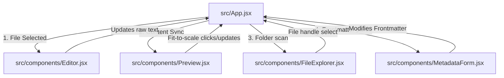

# Feder Project Architectural Understanding Guide

This document serves as an entry-point guide for AI coding agents working on **Feder**. It maps out the project structure, state flows, styling systems, and crucial file relations to avoid redundant full-codebase lookups.

---

## High-Level Architecture

Feder is a premium multi-mode writing application built on **Vite + React** and packaged for desktop using **Electron**. It operates around distinct writing profiles called "modes" (Journalist, Scholar, Researcher, Engineer, Scriptwriter) that dynamically transform editor styles, document templates, cover sheets, metadata configurations, and reference indices.

### Technology Stack
- **Bundler & Core**: Vite, React (v19)
- **UI Framework**: Vanilla React (No Tailwind unless explicitly requested), customized CSS variables (`index.css`, `App.css`) for light, semi-dark, and dark themes.
- **Persistent Storage**: IndexedDB (via `idb-keyval` in `db.js`) storing workspace handles, recent projects, and editor preferences.
- **File System Interaction**: HTML5 File System Access API (with native desktop path adapters in Electron environment).

---

## Directory Structure & Component Map

The main business logic is contained inside `/src`:

```
src/
 ├── App.jsx                 # Central coordinator, core states, directory scanners, global actions
 ├── App.css                 # Main application styling (layout, themes, panel variables)
 ├── index.css               # Core design system tokens (harmonies, typography, scrollbars, colors)
 ├── main.jsx                # React mount point and runtime bootstrap
 │
 ├── components/             # React view components
 │    ├── Layout.jsx         # App border layout, toolbar actions, header & footer integration
 │    ├── WelcomeScreen.jsx  # Landing view: recent projects list, global configuration, project creation
 │    ├── FileExplorer.jsx   # Recursive directory tree navigation, rename/move/delete, ordering overrides
 │    ├── Editor.jsx         # CodeMirror/textarea core editor, handles selections, AI, inline comment cards
 │    ├── Preview.jsx        # Document compiler (ReactMarkdown, LaTeX/Math, references index, comments overlay)
 │    ├── NotesGraph.jsx     # Verlet physics canvas simulator mapping files connections in `notes/`
 │    ├── MetadataForm.jsx   # Contextual metadata editor (detects regular frontmatter vs note connections)
 │    ├── ResizablePanels.jsx# Mouse drag listener dividing Left / Center / Right panels
 │    ├── SettingsModal.jsx  # API configurations, key storage, AI models selection, templates defaults
 │    └── StatusBar.jsx      # Bottom indicators (AI status, cancellation tokens, word counters)
 │
 ├── hooks/
 │    └── useFileSystem.js   # Unified browser FS API + Electron file system wrapper
 │
 └── utils/
      ├── db.js              # IDB store management for persistent configurations and handles
      ├── latexExport.js     # Parses compiled Markdown trees to construct valid LaTeX (.tex) schemas
      └── aiSuggestions.js   # API clients bridging OpenAI, Gemini, and Ollama for text transformations
```

---

## Core Data & State Flow

Feder utilizes a single-direction state management pattern driven by central states defined in `src/App.jsx`.



### Key Shared States (App.jsx)
- `content` / `previewContent`: Stores the raw markdown/text of the open file and the synchronized preview buffer.
- `metadata`: Contains the frontmatter configuration extracted from the top of the currently active markdown file.
- `projectMetadata`: Stored globally inside the project's root folder as `project_metadata.json`. Holds custom file orders, comments history, and project configuration overrides.
- `currentFile`: `{ name: string, kind: 'md' | 'image' | 'bib' | 'txt' | 'json', handle: FileSystemFileHandle }` represent the open file descriptor.
- `hasNotesDir` / `notesList`: Detects if a `notes/` subdirectory is present in the workspace, recursively scanning and cataloging tags, colors, and relative links connections.

---

## Writing Modes Specification

Feder adapts to the current project `mode` dynamically:

1. **Researcher** (Default)
   - *Workspace defaults*: `main.md`, `references.bib`, `figures/`
   - *Preview template*: Formal academic paper layout with APA citations and bibliography indexes.
2. **Journalist**
   - *Workspace defaults*: `notes.md`, `drafts/`, `interviews/`
   - *Preview template*: Clean editorial Dateline Datagrid. Frontmatter controls source listings.
3. **Engineer**
   - *Workspace defaults*: Structural breakdown folders (`1_Exposure_Model`, `Hazards`, `figures`)
   - *Preview template*: Formal engineering calculations reports with checkers, approvals, and dynamic Table of Contents (ToC).
4. **Scholar**
   - *Workspace defaults*: ` syllabus.md`, `Lecture Notes/`, `Assignments/`
   - *Preview template*: Lecture syllabus layout, including objectives lists with interactive check-boxes.
5. **Scriptwriter**
   - *Workspace defaults*: `script.md`
   - *Preview template*: Courier screenplay format with character indentation, dialogue alignments, parentheticals, and scene boundaries.

---

## Design & Styling Guidelines

Feder has a premium glassmorphic visual system managed exclusively using CSS custom properties.
- **Harmonies**: Do not inject ad-hoc custom styles unless necessary. Standard theme variables are parsed from `index.css`:
  - `var(--bg-app)` / `var(--bg-panel)` / `var(--bg-card)`
  - `var(--text-primary)` / `var(--text-secondary)`
  - `var(--border-color)`
  - `var(--accent-color)`
- **Responsive Animations**: Utilize transitions on interactive elements (`transition: all 0.2s ease-in-out`).

---

## Speed-Run Work Guide for Agents

Before changing code, consider this brief checklist:
- **Adding dynamic UI tabs or displays in the preview area?** Open `src/components/Preview.jsx` and map your component inside the tab routing blocks.
- **Modifying file handling, saving, or metadata extraction?** Check `scanNotesDir`, `handleFileSelect`, and `handleSave` in `src/App.jsx`.
- **Styling updates?** Inject tokens or declarations into `src/index.css` or `src/App.css`. Do not load additional frameworks.
- **Database variables?** Verify indexedDB keys inside `src/utils/db.js`.
